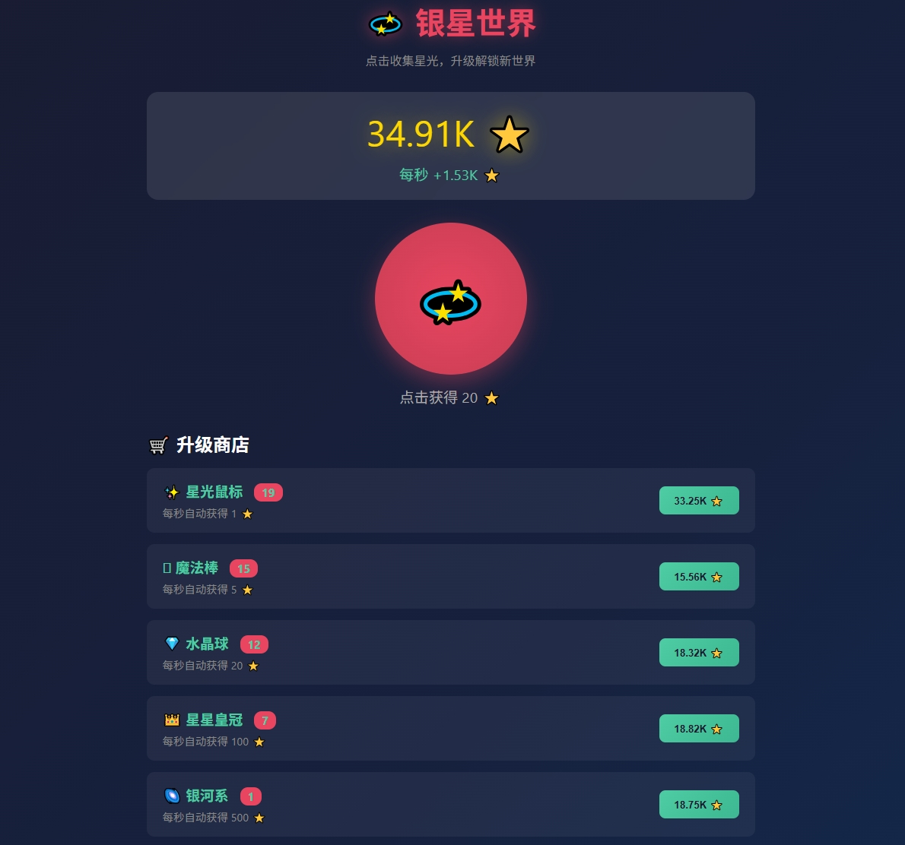

# 💫 银星世界 

A beautiful idle click game - collect starlight in the vast starry sky, unlock upgrades, and explore the ultimate secrets of the universe!

一款简约精美的放置类点击游戏，在浩瀚星空中收集星光，解锁升级，探索宇宙的终极奥秘！

[English](#english) | [中文](#中文)

---

## 🎮 Game Preview



Click the star button to collect ⭐, purchase upgrades for passive income, and unlock achievements to become the Galaxy Lord!

---

## ✨ Features

- **Click Collection**: Click the star button to earn ⭐
- **Auto Income**: Purchase upgrades to automatically earn ⭐ per second
- **Achievement System**: 8 achievements to unlock
- **Offline Earnings**: Earn offline收益 when you return!
- **Auto Save**: Automatically saves to local storage every 30 seconds

---

## 🛒 Upgrade Shop

| Upgrade | Base Cost | Income/sec | Cost Multiplier |
|---------|-----------|------------|-----------------|
| ✨ Star Mouse | 15 ⭐ | +1 ⭐/s | ×1.5 |
| 🪄 Magic Wand | 100 ⭐ | +5 ⭐/s | ×1.4 |
| 💎 Crystal Ball | 500 ⭐ | +20 ⭐/s | ×1.35 |
| 👑 Star Crown | 3,000 ⭐ | +100 ⭐/s | ×1.3 |
| 🌌 Galaxy | 15,000 ⭐ | +500 ⭐/s | ×1.25 |
| 🌟 Heart of the Universe | 100,000 ⭐ | +3,000 ⭐/s | ×1.2 |
| 🔮 Multiverse | 1,000,000 ⭐ | +20,000 ⭐/s | ×1.15 |

---

## 🏆 Achievement List

| Achievement | Requirement | Reward |
|-------------|-------------|--------|
| ⭐ First Star | Collect 1 ⭐ total | Unlocks game |
| 🌟 Small Harvest | Collect 100 ⭐ total | - |
| 💫 Glowing Stars | Collect 1,000 ⭐ total | - |
| 🌊 Star Ocean | Collect 10,000 ⭐ total | - |
| 🏆 Galaxy Lord | Collect 1,000,000 ⭐ total | - |
| 🛒 First Upgrade | Purchase first upgrade | - |
| 🤖 Auto Collector | Earn 100 ⭐/sec | - |
| 👆 Click Master | Earn 100 ⭐ per click | - |

---

## 🚀 How to Run

### Method 1: Direct Open
Simply open `index.html` in your web browser to start playing.

### Method 2: Local Server
```bash
# Using Python
python -m http.server 8000

# Using Node.js
npx serve .
```

Then visit `http://localhost:8000`

---

## 📂 Project Structure

```
idlegame/
├── index.html    # Main game file (single-page application)
└── README.md     # Project documentation
```

---

## 🛠️ Tech Stack

- **HTML5** - Page structure
- **CSS3** - Styling and animations (gradients, blur, transitions)
- **JavaScript (ES6+)** - Game logic
- **localStorage** - Data persistence

---

## 📝 License

MIT License - Free to use and modify

---

## 👤 Author

Silver Swab 💫

---

## 🤖 AI Contribution Statement

All work on this project, including game code, image design and creativity, and version management, was completed independently by AI.

---

# 中文

## 💫 银星世界

一款简约精美的放置类点击游戏，在浩瀚星空中收集星光，解锁升级，探索宇宙的终极奥秘！

## 🎮 游戏预览


点击星光按钮收集⭐，购买升级获得被动收入，解锁成就成为银河霸主！

## ✨ 特性

- **点击收集**：点击星光按钮获得⭐
- **自动收益**：购买升级后每秒自动获得⭐
- **成就系统**：8种成就等你解锁
- **离线收益**：关闭页面后再次打开可获得离线收益
- **自动保存**：每30秒自动保存到本地

## 🛒 升级商店

| 升级 | 基础成本 | 收入/秒 | 成本倍率 |
|------|----------|---------|----------|
| ✨ 星光鼠标 | 15 ⭐ | +1 ⭐/s | ×1.5 |
| 🪄 魔法棒 | 100 ⭐ | +5 ⭐/s | ×1.4 |
| 💎 水晶球 | 500 ⭐ | +20 ⭐/s | ×1.35 |
| 👑 星星皇冠 | 3,000 ⭐ | +100 ⭐/s | ×1.3 |
| 🌌 银河系 | 15,000 ⭐ | +500 ⭐/s | ×1.25 |
| 🌟 宇宙之心 | 100,000 ⭐ | +3,000 ⭐/s | ×1.2 |
| 🔮 多元宇宙 | 1,000,000 ⭐ | +20,000 ⭐/s | ×1.15 |

## 🏆 成就列表

| 成就 | 条件 | 奖励 |
|------|------|------|
| ⭐ 初遇星光 | 累计获得 1 ⭐ | 解锁游戏 |
| 🌟 小有收获 | 累计获得 100 ⭐ | - |
| 💫 星光璀璨 | 累计获得 1,000 ⭐ | - |
| 🌊 星光大海 | 累计获得 10,000 ⭐ | - |
| 🏆 银河霸主 | 累计获得 1,000,000 ⭐ | - |
| 🛒 初次升级 | 购买第一个升级 | - |
| 🤖 自动吸星 | 拥有每秒 100 收入 | - |
| 👆 点击大师 | 单次点击获得 100 ⭐ | - |

## 🚀 如何运行

### 方法一：直接打开
在浏览器中直接打开 `index.html` 文件即可开始游戏。

### 方法二：本地服务器
```bash
# 使用 Python
python -m http.server 8000

# 使用 Node.js
npx serve .
```

然后访问 `http://localhost:8000`

## 📂 项目结构

```
idlegame/
├── index.html    # 游戏主文件（单页面应用）
└── README.md     # 项目说明文档
```

## 🛠️ 技术栈

- **HTML5** - 页面结构
- **CSS3** - 样式与动画（渐变、模糊、过渡）
- **JavaScript (ES6+)** - 游戏逻辑
- **localStorage** - 数据持久化

## 📝 许可证

MIT License - 自由使用与修改

## 👤 作者

银星拭子 💫

## 🤖 AI 贡献声明

本项目所有工作，包括游戏代码、图片设计与创意、版本管理，均由 AI 独立完成。

## License

MIT License
